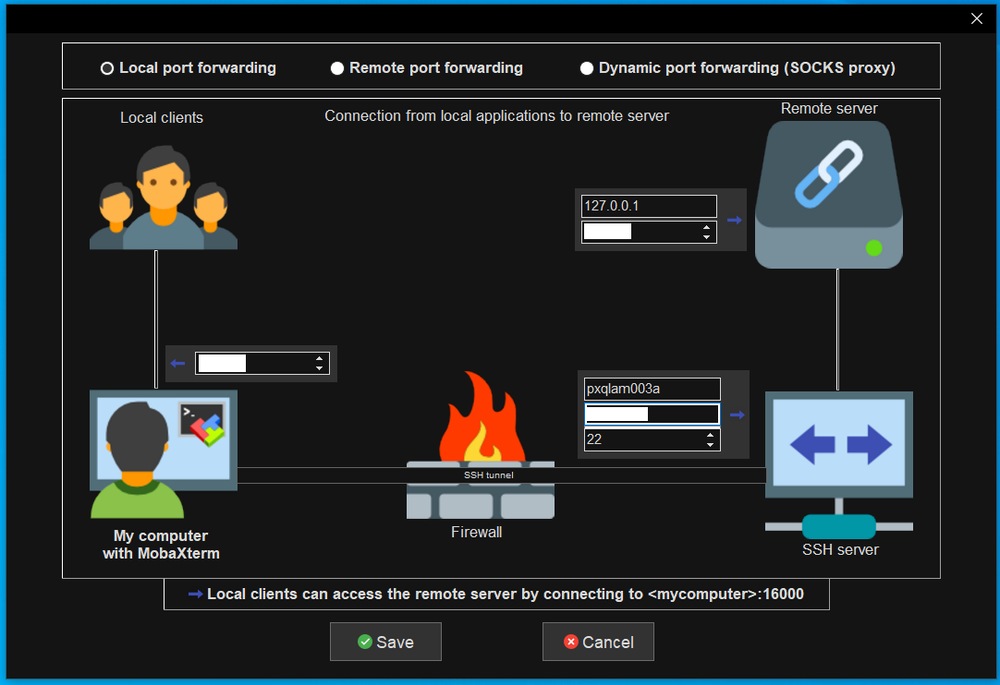

# research_utils
Common commands and utils to take note of when working in lab.

Feel free to add to the README or add scripts that makes life easier here.

# Copying to and from different servers
Use rsync: ```python rsync -r username@server1_IP:source_dir username@server2_IP:destination_dir ```

# Copying to and from  GCP
1. bash (to use gcloud)
2. Auth login first using:
```python gcloud auth login --no-launch-browser ```
3. Use gsutil to copy from one dir to another in the server:
```python gsutil -m cp -r "gs://ml-bf1c-phi-shared-aif-us-p/GCP_location" /media/Datacenter_storage/server_location/ ```

# Using Jupyter Notebook on server (MobaXTerm)
First set up an SSH tunnel with the following parameters (with your credentials):

Then start the SSH tunnel and run the following command:
```python
jupyter notebook --no-browser
```

# Tmux (running processes in the server without disconnecting)
```python
# create a new session with a session name (easier to figure out which session is which)
tmux new -s session_name

#Detaching from Tmux Session:
Ctrl+b d

#Listing current tmux sessions:
tumx ls

#Attaching to tmux sessions:
tmux attach-session -t named_session

#Killing sessions:
tmux kill-session -t 3
```

# Git issues:
### commited large files to git repo and need to remove (blob.txt as an example):
> Github won't let you push large files to your repo and if you somehow got to the limit and wanted to push something small that would put it over the limit, it will cause issues. However, since Github keeps the history of your commits with the files, the solution is not as simple as removing the large files from your repo. So you'll need to delete the large files from your repo history through BFG Repo-Cleaner. (There are other ways to remove from the history but for me, it was the easiest and most straight forward method).

Use BFG Repo-Cleaner: https://rtyley.github.io/bfg-repo-cleaner/
3
